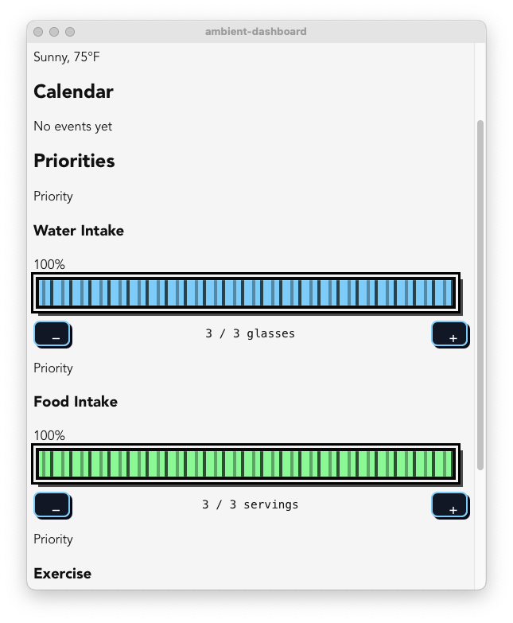

# Ambient Dashboard

A calm, retro-styled desktop dashboard for seeing daily priorities at a glance.

Ambient Dashboard is a React interface packaged with Tauri. The current prototype combines quick status cards with interactive progress controls for water, food, exercise, and other daily priorities.

> **Status:** active prototype with a responsive dashboard, local priorities, a focus timer, theme palettes, and on-device session history.



The screenshot documents an earlier milestone; the current interface has evolved into the responsive ambient workspace described below.

## Current capabilities

- retro ambient dashboard layout
- reusable priority/progress components with local persistence
- 25-minute focus and 5-minute break timer
- on-device recent-session history and daily completion count
- switchable night-bloom and forest color palettes
- configurable starting values, maximums, steps, units, and colors
- increment and decrement controls
- Tauri desktop shell
- a development log with visual progress screenshots

## Technology

- React 19
- TypeScript
- Vite
- Tauri 2 and Rust
- CSS

## Architecture

```text
React dashboard
  -> status cards
  -> FocusTimer + local session history
  -> reusable Priority components
  -> local theme and progress state
          |
          v
     Tauri desktop shell
```

The frontend is under `src/`; the native desktop wrapper and permissions are under `src-tauri/`.

## Setup

Required:

- Node.js
- npm
- Rust toolchain
- platform-specific Tauri prerequisites

```bash
npm install
```

## Run

Browser development:

```bash
npm run dev
```

Desktop development:

```bash
npm run tauri dev
```

Production checks:

```bash
npm run build
npm run tauri build
```

## Build check

Run `npm run build` to perform the TypeScript and Vite production check.

## Current limitations

- weather and calendar integrations are intentionally unconnected
- timer completion has no sound or operating-system notification yet
- keyboard and screen-reader behavior still needs a full manual review
- the application still uses default Vite/Tauri title and icon references in places

## High-value next steps

- add optional timer durations and desktop notifications
- replace remaining starter icon assets
- add keyboard-accessible controls and empty/error states
- add component tests and desktop build CI

## Project history

The screenshot sequence in `docs/screenshots/` and [development log](docs/DEVLOG.md) show the dashboard evolving from its initial setup through interactive priority controls.

## License and authorship

Created by [SimpleCaci](https://github.com/SimpleCaci). A project license has not yet been selected.
